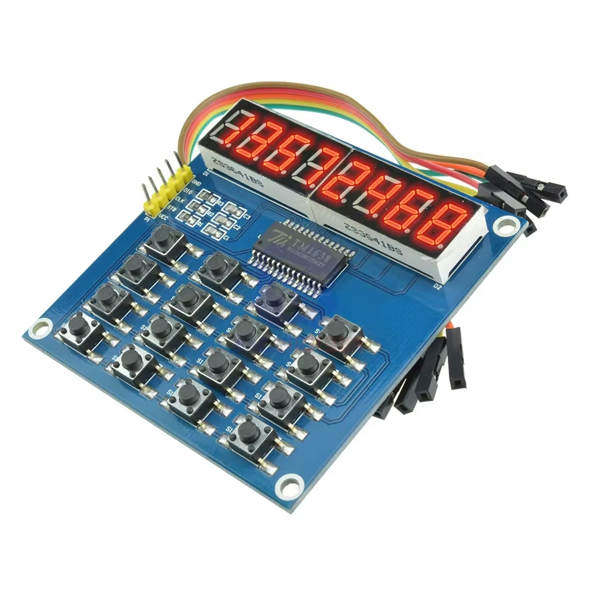

# TM1638_16btn Library

## Description

The **TM1638_16btn** library **v0.1.0-beta.1** is designed to control a **TM1638** module (common anode) with a 16-button input matrix and an 8-digit 7-segment LED display. This library enables easy interaction with the display, control over the brightness, handling of button presses, and displaying numeric or textual data on the LEDs.

This library was specifically developed using the Espressif IDE for ESP32 microcontrollers.



## Features

- Display numbers with or without decimal points.
- Display text on the 8-digit display.
- Control the brightness of the display.
- Detect button presses, including long presses and debounced input.
- Support for up to 16 buttons.

## Methods

### Constructor

```cpp
TM1638_16btn(gpio_num_t strobe_pin, gpio_num_t clock_pin, gpio_num_t data_pin);
```

**Parameters:**
- `strobe_pin`: GPIO pin for strobe signal.
- `clock_pin`: GPIO pin for clock signal.
- `data_pin`: GPIO pin for data signal.

Initializes the TM1638 module and sets up the required GPIO pins.

### `init_gpio`

```cpp
void init_gpio();
```

Initializes the GPIO pins for the strobe, clock, and data signals. This method must be called before interacting with the display or buttons.

### `set_brightness`

```cpp
void set_brightness(uint8_t brightness);
```

Sets the brightness level of the display.

**Parameters:**
- `brightness`: Brightness value (0 to 15, where 0 is dimmest and 15 is brightest).

### `clear_all`

```cpp
void clear_all();
```

Clears the display, turning off all segments.

### `show_number`

```cpp
void show_number(int32_t number, int decimalPoint = -1);
```

Displays an integer number on the 8-digit display. A decimal point can be placed in any position by specifying `decimalPoint`.

**Parameters:**
- `number`: The integer to display (up to 8 digits).
- `decimalPoint`: (Optional) Position of the decimal point (0-7). Default is `-1` (no decimal point).

### `show_decimal`

```cpp
void show_decimal(float number, int decimal_places = 4, bool should_round = true);
```

Displays a floating-point number on the display.

**Parameters:**
- `number`: The floating-point number to display.
- `decimal_places`: Number of decimal places to show.
- `should_round`: Whether the number should be rounded.

### `show_text`

```cpp
void show_text(const char* text);
```

Displays a text string on the 8-digit display.

**Parameters:**
- `text`: A string (up to 8 characters) to display. 

### `detect_button_press`

```cpp
ButtonPressInfo detect_button_press(int long_press_threshold_ms, int debounce_delay_ms);
```

Detects which button is pressed and whether it's a long press.

**Parameters:**
- `long_press_threshold_ms`: Threshold for long press detection in milliseconds.
- `debounce_delay_ms`: Debounce delay in milliseconds.

**Returns:** A `ButtonPressInfo` structure containing:
- `button`: The button number pressed.
- `is_long_press`: Boolean indicating if it was a long press.

## Installation

To use the **TM1638_16btn** library, simply copy the library files (`TM1638_16btn.h` and `TM1638_16btn.cpp`) into your project and include the header in your main code.

```cpp
#include "TM1638_16btn.h"
```

Make sure to configure the appropriate GPIO pins for your ESP32 device.

## License

This library is open-source and licensed under the MIT License.
